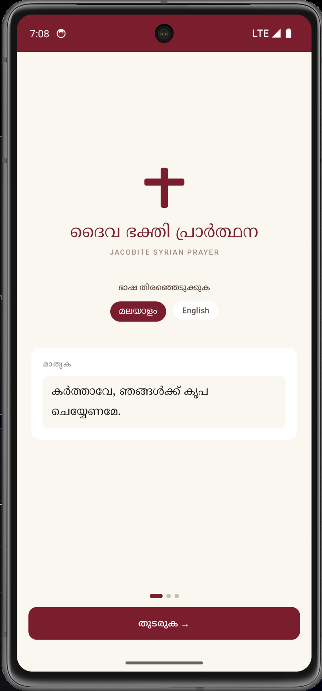
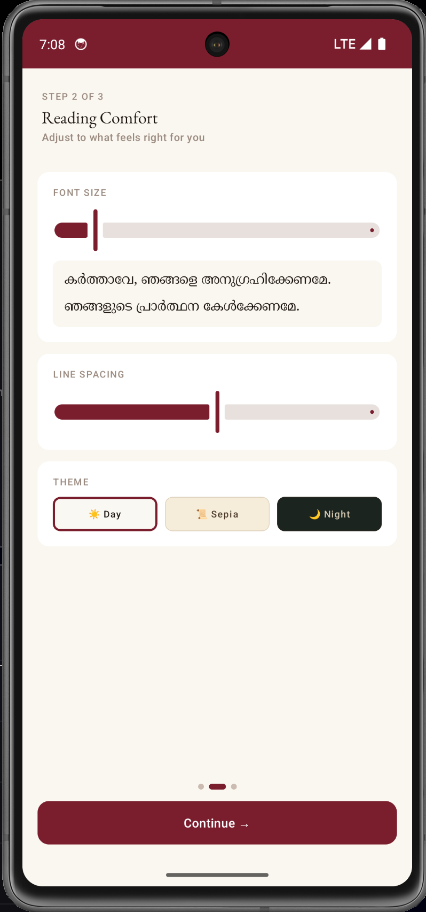
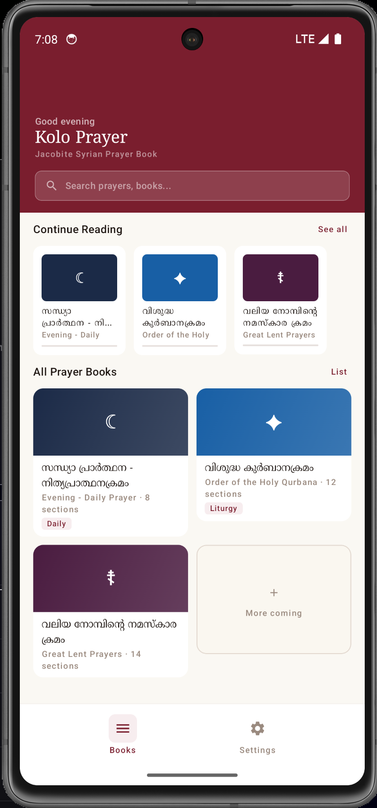
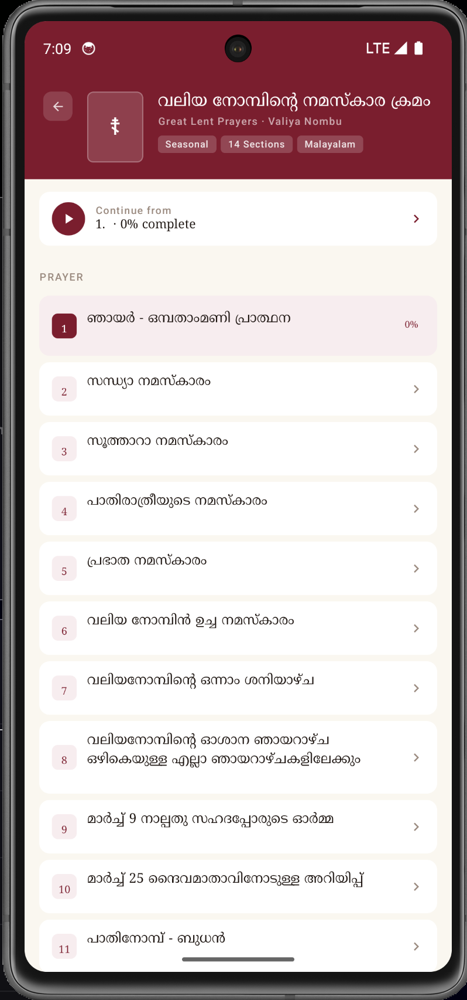
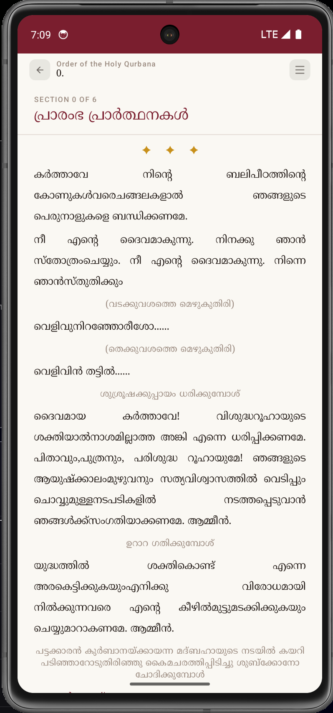
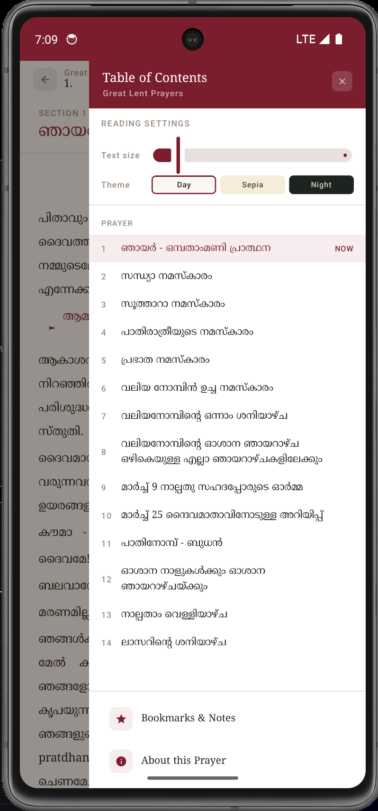
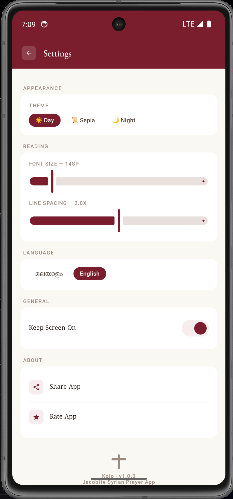

# ☦ KOLO (Prayer Companion)
### *Liturgical companion for the Malankara Jacobite Syrian Church*

`Kolo` is a sophisticated, high-fidelity Android application dedicated to the liturgical traditions of the Malankara Jacobite Syrian Church. It provides a beautiful, distraction-free environment for prayers, the Holy Qurbana, and seasonal liturgical offices, combining ancient faith with modern high-premium design.

---

## 📱 Visual Experience

<div align="center">

| | | |
| :---: | :---: | :---: |
|  |  |  |
| *Welcome & Onboarding* | *Language & Setup* | *Home: Liturgical Library* |

| | | |
| :---: | :---: | :---: |
|  |  |  |
| *Book Progress Detail* | *Chant & Verse Rendering* | *Sepia / Night Modes* |

| |
| :---: |
|  |
| *Personalized Reader Settings* |

</div>

---

## ✨ Key Features

### 📖 Advanced Liturgical Reader
*   **Intuitive Speaker Identification**: Distinct visual styles for **Priests**, **Deacons**, **Readers**, and the **Congregation**.
*   **Intelligent Chant Grouping**: Automatic poetic formatting (italics and wide-margin centering) for liturgical chants.
*   **Response Highlighting**: High-contrast markers (►) for congregation responses, ensuring you never miss a recitation.
*   **Dynamic Breadcrumbs**: Instant section-to-section navigation that remembers exactly where you left off.

### 🌓 Premium Personalization
*   **Three High-Fidelity Themes**: 
    *   **Day**: Crisp Ink on Cream surface.
    *   **Sepia**: Warm, book-like reading experience.
    *   **Night**: Deep Indigo surfaces optimized for low-light worship.
*   **Typography Controls**: Live adjustments for font size and line height using the **Noto Serif Malayalam** font family.
*   **Utility**: "Keep Screen On" mode for hands-free reading during long services.

### 💾 Smart Sync & Persistence
*   **Real-time Progress Tracking**: Per-book percentage metrics based on read sections.
*   **Offline First**: Comprehensive local caching via **Jetpack DataStore** ensuring your prayers are accessible without a connection.
*   **Cloud Liturgy**: **Firebase Firestore** backend (custom `default` instance) allows for instant OTA updates of prayer books without app updates.

---

## 🛠️ Technical Architecture

### Core Tech Stack
*   **Language**: Kotlin
*   **Framework**: Jetpack Compose (100% Declarative UI)
*   **Async**: Kotlin Coroutines & Flow
*   **Dependency Injection**: Hilt (Dagger)
*   **Local Storage**: Jetpack DataStore / Room-ready Architecture
*   **Cloud Backend**: Firebase (Firestore & App Distribution)
*   **Data Models**: Kotlin Serialization (JSON-driven liturgy engine)

### Liturgy Compilation Engine
The app includes a custom Python-based compilation pipeline (`upload_to_firestore.py`) that converts Markdown/JSON liturgical scripts into organized Firestore documents, supporting complex speaker mapping and section sorting.

---

## 🚀 Getting Started

### Prerequisites
*   Android Studio Ladybug or later.
*   JDK 17.
*   Firebase Project (Google Services JSON).

### Build & Deploy
1.  **Clone the Repository**:
    ```bash
    git clone https://github.com/Habel/kolo-app.git
    ```
2.  **Add Firebase Configuration**:
    Place your `google-services.json` in the `app/` directory.
3.  **Compile & Run**:
    ```bash
    ./gradlew installDebug
    ```
4.  **Sync Liturgy (Admin)**:
    ```bash
    python3 upload_to_firestore.py
    ```

---

## ⚖️ License
© 2026 Kolo App Team. Designed with reverence for the liturgical life of the Malankara Jacobite Syrian Church.
